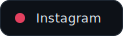

---

<table>
<tr>
<td width="60%" valign="top">

### About Me

- 🏗️ Founder of **[SakaSoft](http://sakasoft.com.tr)** — building digital products
- 🚀 Currently building **[Gymplus AI](http://gymplusai.com)** — AI-powered fitness platform
- 💻 Fullstack Developer — React, Nest.js, React Native
- 📍 Based in **Istanbul, Turkey**
- 🌐 [muhammedozel.com](http://muhammedozel.com) · ✉️ [muhammed@sakasoft.com.tr](mailto:muhammed@sakasoft.com.tr)

</td>
<td width="40%" align="center" valign="middle">

</td>
</tr>
</table>

---

<h3 align="center">Tech Stack</h3>

   
  <b>Frontend</b> — React / Next.js / Vue / Nuxt.js / TailwindCSS

   
  <b>Backend</b> — Node.js / Nest.js / TypeScript / GraphQL

   
  <b>Mobile & Design</b> — React Native / Expo / Figma

   
  <b>DevOps</b> — Docker / AWS / Vercel / Railway / GitHub Actions

---

<h3 align="center">GitHub Stats</h3>

---

<h3 align="center">Contribution Activity</h3>

  

---

  &nbsp;
  &nbsp;
  

---

  

